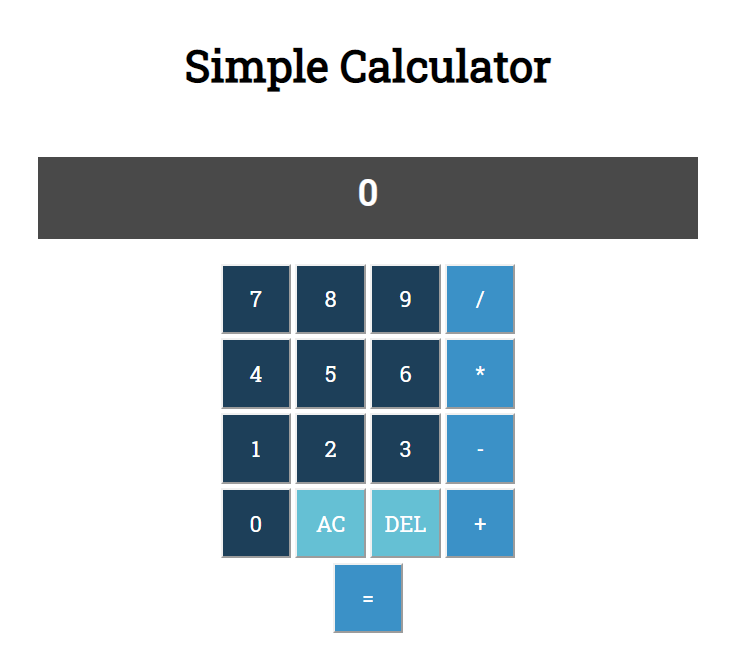

# Calculator JS
A project made fot [The Odin Project](https://www.theodinproject.com/courses/web-development-101/lessons/calculator)

Demonstrates usage of factory functions, DOM manipulation, modules and event listeners.

Hosted [here](https://koken-y.github.io/calculator/)

## Features
- String multiple operations
- Disallow dividing by 0

## ToDo 
-  Allow negatives for first value
-  Allow decimal inputs
-  Round decimal outputs
-  Use scientific notation for long outputs

